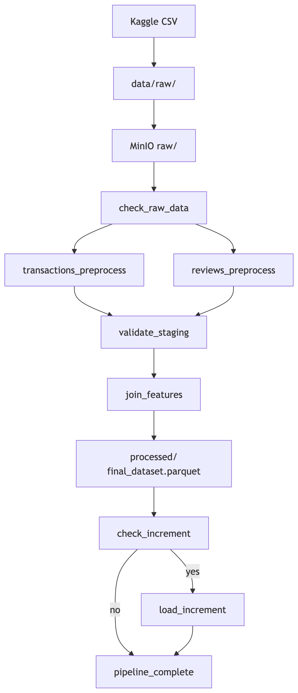

# Лабораторная работа 1: Предобработка данных

## Постановка задачи

Предсказание удовлетворённости клиента (бинарная классификация) на основе данных
бразильского маркетплейса Olist: время доставки, категория товара, тональность отзыва.

Целевая переменная: `is_satisfied` (1 = оценка ≥ 4, 0 = оценка < 4)

Метрики оценки модели: F1-score (основная), ROC-AUC, Precision, Recall.
Классы несбалансированы (~57% довольных), поэтому accuracy не показательна.

## Архитектура



## Выбор хранилища — MinIO (локальный S3)

Обоснование:
- S3-совместимый API — промышленный стандарт для data lake
- Легко разворачивается в Docker без облачных расходов
- Слоистая структура хранения: `raw/` → `staging/` → `processed/`
- Бесшовная замена на облачный S3/Yandex Object Storage в будущем

### 2. Запуск инфраструктуры

```bash
cd lab1/
docker compose up -d
```

### 3. Скачивание датасета

```bash
cd lab1/data/raw
kaggle datasets download -d olistbr/brazilian-ecommerce --unzip
```

### 4. Загрузка данных в MinIO

```bash
python scripts/upload_raw_data.py
```

Переменные по умолчанию указывают на MinIO на `localhost:9000`.

### 5. Запуск пайплайна

Открыть AirFlow UI: `http://localhost:8081` (внешний порт 8081).
Логин: `admin` / Пароль: `admin`

Trigger DAG `ecommerce_preprocessing_pipeline`.

### 6. Просмотр данных в MinIO

Открыть MinIO UI: `http://localhost:9001`
Логин: `minioadmin` / Пароль: `minioadmin`

## Структура проекта

```
lab1/
├── docker-compose.yml         # AirFlow + MinIO + PostgreSQL
├── Dockerfile                 # AirFlow + зависимости
├── requirements.txt
├── dags/
│   └── ecommerce_pipeline.py  # Основной DAG
├── scripts/
│   ├── minio_utils.py         # Утилиты для работы с MinIO
│   ├── upload_raw_data.py     # Загрузка CSV в MinIO
│   ├── transactions_preprocess.py  # Транзакционные данные
│   ├── reviews_preprocess.py  # Отзывы + геоданные
│   ├── join_features.py       # Объединение фичей
│   └── load_increment.py      # Инкрементальная загрузка
├── notebooks/
│   ├── eda_transactions.ipynb # EDA транзакционной части
│   └── eda_reviews.ipynb      # EDA отзывов и геоданных
└── data/
    ├── raw/                   # Исходные CSV с Kaggle
    └── increment/             # Файлы для инкрементальной загрузки
```

## DAG: ecommerce_preprocessing_pipeline

| Задача | Описание |
|---|---|
| `check_raw_data` | Проверяет наличие CSV в MinIO `raw/` |
| `transactions_preprocess` | Join таблиц, обработка пропусков, feature engineering |
| `reviews_preprocess` | Токенизация отзывов, TF-IDF (sklearn), расстояние покупатель-продавец |
| `validate_staging` | Проверка схемы и заполненности промежуточных файлов |
| `join_features` | Объединение результатов обеих веток предобработки |
| `check_increment` | Ветвление: есть ли новые файлы в `increment/`? |
| `load_increment` | Загрузка и мерж инкрементальных данных |

Расписание: `@daily` (каждый день в полночь).

## Инкрементальная загрузка

### Быстрый демо-инкремент (из части processed-датасета)

После успешного полного прогона пайплайна в MinIO есть `processed/final_dataset.parquet`. Скрипт берёт случайные строки, присваивает им новые `order_id` и кладёт parquet в `data/increment/` и в MinIO `increment/`:

```bash
python scripts/build_increment_sample.py -n 400
```

Флаг `--no-upload` — только локальный файл.

DAG при следующем запуске обработает файл и дополнит `processed/final_dataset.parquet`.
