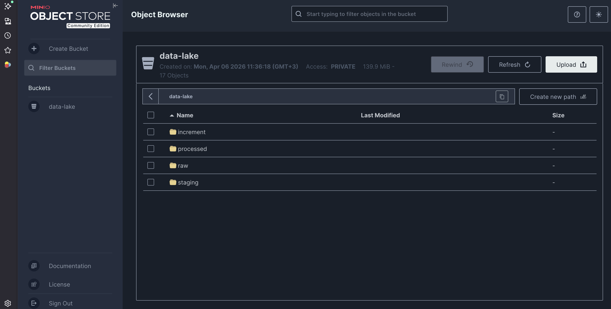
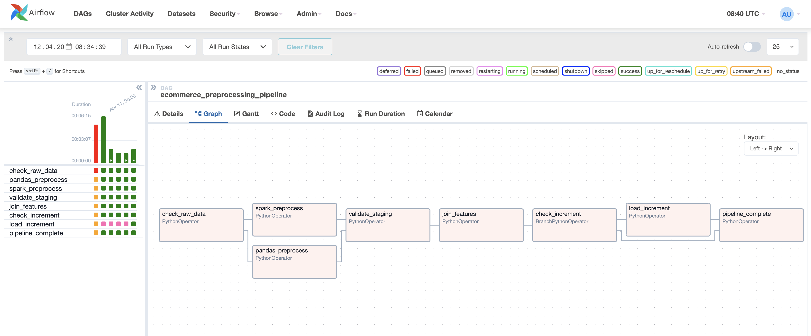

# Отчёт: лабораторная работа 1 — предобработка данных

**Тема:** автоматизация предобработки данных, оркестрация (Apache Airflow), хранилище S3-совместимое (MinIO).

---

## 1. Датасет

- **Источник:** Kaggle, [Brazilian E-Commerce (Olist)](https://www.kaggle.com/datasets/olistbr/brazilian-ecommerce).
- **Содержание:** заказы, позиции заказов, товары, клиенты, отзывы, геолокации, оплаты, перевод категорий и др. (CSV в `lab1/data/raw/`).
- **Загрузка:** Kaggle CLI; сырые файлы дополнительно выгружаются в MinIO в префикс `raw/`.

---

## 2. Постановка задачи ML (после предобработки)

- **Задача:** бинарная классификация — предсказать **удовлетворённость клиента** по признакам заказа, доставки, товара и блока отзывов/гео.
- **Целевой признак:** `is_satisfied` (1, если оценка отзыва ≥ 4; иначе 0), формируется в `reviews_preprocess.py`.
- **Метрики (для лаб. 2):** F1 (основная при дисбалансе классов), ROC-AUC, Precision, Recall.

---

## 3. Хранилище обработанных данных

- **Выбрано:** **MinIO** (локально в Docker), S3-совместимый API.
- **Обоснование:** стандартный подход к data lake; один слой для сырых, промежуточных и итоговых данных; доступ через `boto3`/`s3fs`; при необходимости замена на облачный S3 без смены кода доступа.
- **Структура бакета `data-lake`:** `raw/` → `staging/` → `processed/`, отдельно `increment/` для дозагрузки.

**Скриншот:** объекты в бакете `data-lake` (веб-консоль MinIO).

## 4. Предобработка и инструменты

| Этап                        | Инструмент                                  | Содержание                                                                                  |
| --------------------------- | ------------------------------------------- | ------------------------------------------------------------------------------------------- |
| Транзакции, товары, клиенты | **pandas** (`scripts/transactions_preprocess.py`) | Join таблиц, даты, пропуски, инженерия признаков, one-hot для части категориальных полей, флаг опоздания доставки |
| Отзывы, геодистанция        | **pandas + sklearn** (`scripts/reviews_preprocess.py`) | Токенизация, стоп-слова (EN+PT), TF-IDF (`TfidfVectorizer`), флаги наличия текста, время ответа на отзыв, расстояние покупатель–продавец (Haversine) |
| Сборка датасета             | **pandas** (`scripts/join_features.py`)     | Агрегация до уровня заказа, вычисление order-level агрегатов и ratio-признаков, inner join с отзывами, запись `processed/final_dataset.parquet` |

Первичный анализ (EDA) оформлен в ноутбуках: `notebooks/eda_transactions.ipynb`, `notebooks/eda_reviews.ipynb`.

По результатам EDA в ноутбуках были выбраны компактные интерпретируемые признаки, которые затем перенесены в preprocessing:

- Для транзакционной ветки: `delivery_delay_days`, бинарный флаг `is_late_delivery`, агрегаты `items_count`, `total_price`, календарные признаки покупки и относительная стоимость доставки.
- Для блока отзывов: `has_message`, `has_title`, `review_text_length`, `response_hours`, `tfidf_norm`.
- Для гео-блока: `avg_seller_distance_km` как средняя дистанция продавец-покупатель на уровне заказа.

Ключевые наблюдения из EDA:

- У неудовлетворённых клиентов медиана `delivery_days` выше: **13 дней** против **9** у удовлетворённых.
- Для заказов без опоздания доля удовлетворённых клиентов составляет около **0.806**, а при опоздании — только **0.318**, поэтому `is_late_delivery` добавлен в пайплайн как отдельный бинарный признак.
- Негативные отзывы чаще содержат текст: доля `has_message` равна **0.63** против **0.35** у положительных отзывов; медиана `review_text_length` также выше (**7** токенов против **0**), поэтому наличие текста и его длина сохранены как отдельные фичи.
- Медианная дистанция продавец-покупатель выше для неудовлетворённых заказов: **471.2 км** против **423.2 км**, поэтому `avg_seller_distance_km` сохранён в итоговом наборе данных.
- `response_hours` оказался интерпретируемым, но менее контрастным признаком: медианы около **39.3** и **40.4** часов, поэтому он оставлен как дополнительная временная характеристика, а не как основной драйвер качества.

---

## 5. Оркестрация (Apache Airflow)

- **DAG:** `ecommerce_preprocessing_pipeline` (`dags/ecommerce_pipeline.py`).
- **Схема:** проверка сырых данных в MinIO → параллельно `transactions_preprocess` и `reviews_preprocess` → валидация staging → `join_features` → ветка по наличию файлов в `increment/` → при необходимости `load_increment` → `pipeline_complete`.
- **Расписание:** `@daily` (демонстрация регулярного запуска).
- **Развёртывание:** Docker Compose (`docker-compose.yml`, кастомный образ с зависимостями), PostgreSQL — метаданные Airflow, веб-интерфейс на порту хоста **8081** (см. README).

**Скриншот:** граф DAG `ecommerce_preprocessing_pipeline` в интерфейсе Airflow (вкладка Graph).

---

## 6. Инкремент

- Требование задания: дозагрузка новых данных и объединение с уже обработанными.
- Реализация: скрипт `scripts/load_increment.py` читает новые `.csv`/`.parquet` из `increment/`, дедуплицирует по `order_id`, дописывает в `processed/final_dataset.parquet`, обработанные файлы переносит в `increment/done/`.
- Демо-инкремент: `scripts/build_increment_sample.py` (выборка из processed с новыми `order_id` + загрузка в MinIO).

---

## 7. Структура каталога `lab1` (ключевые пути)

- `docker-compose.yml`, `Dockerfile` — инфраструктура  
- `dags/` — DAG Airflow  
- `scripts/` — предобработка, MinIO, инкремент  
- `data/raw/`, `data/increment/` — локальные данные  
- `notebooks/` — EDA  
- `README.md` — инструкция по запуску