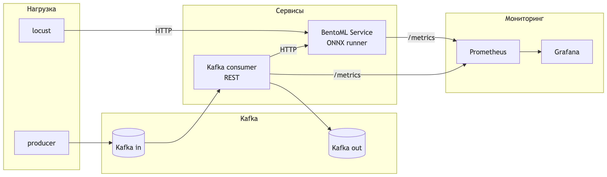

# Лабораторная 3 — Развёртывание ONNX-модели через BentoML и Kafka

## 1. Краткое описание

Реализован сервинг бинарной классификации удовлетворённости клиентов Olist
(`StandardScaler + XGBClassifier`, обученный в ЛР2 и зафиксированный в MLflow).
Конкретно — лучший run по `test_f1` из эксперимента `olist_satisfaction_v6`:
`hyp1_xgb_n=300_lr=0.05` (XGBoost: `n_estimators=300, learning_rate=0.05`,
`test_f1=0.9043`, `test_roc_auc=0.8008`, 71 признак).

Полный цикл:

1. Лучшая модель из MLflow экспортируется в **ONNX** целиком, вместе с препроцессингом
   (`Scaler` + `TreeEnsembleClassifier` в одном графе).
2. Модель сервируется через **BentoML** (REST `/predict` + автоматический `/metrics`).
3. Параллельно работает Kafka-pipeline: producer пишет запросы в `inference_requests`,
   consumer читает их, ходит REST-ом в BentoML и публикует ответы в `inference_responses`.
4. Сервис подключён к **Prometheus + Grafana** (auto-provisioning датасорса и дашборда).
5. Нагрузочное тестирование через **Locust**.

## 2. Анализ форматов экспорта

| Формат | Что включает | Плюсы | Минусы | Применимость |
|--------|--------------|-------|--------|--------------|
| Pickle (sklearn native) | Бинарный Python-объект | Минимум кода, нативно | Привязка к версиям Python/библиотек, не межплатформенно, без оптимизации, риски при загрузке чужих файлов | Прототип, MLflow tracking |
| MLflow PyFunc / sklearn flavor | Артефакт + conda окружение | Удобство интеграции с MLflow, без ручной конвертации, поддержка MLflow Serving | Требует Python + sklearn + xgboost в продакшене, увеличенный размер Docker-образа | Альтернатива при ML-инфраструктуре на базе MLflow Serving |
| **ONNX** *(выбран)* | Граф вычислений: препроцессинг + модель в одном файле | Кросс-платформенно, без зависимости от python-обучения, быстрый рантайм (`onnxruntime`), нативная поддержка в BentoML (`bentoml.onnx`) | Нужны конвертеры (`skl2onnx`, `onnxmltools`), не все операторы покрыты | Идеально подходит — лёгкий артефакт + единый рантайм |
| TensorRT | Скомпилированный engine под NVIDIA GPU | Максимальный throughput на GPU | Только NVIDIA GPU, тяжёлый toolkit, не нужен для CPU-инференса бустингов | Не применимо, инференс CPU |
| PMML | XML-описание модели | Кросс-платформенно | Устаревший стандарт, ограничены операторы, плохо для XGBoost | Не применимо |
| Treelite / m2cgen | Скомпилированные деревья | Самый быстрый CPU-инференс | Только деревья, без препроцессинга, неудобно обновлять | Резерв при оптимизации |

**Выбран ONNX**, потому что:
1. Конвертация всего sklearn-pipeline (`StandardScaler` + `XGBClassifier`) в один граф через
   `skl2onnx` с регистрацией `onnxmltools.convert.xgboost.convert_xgboost`.
2. Лёгкий рантайм `onnxruntime`, не требующий установки `xgboost`/`sklearn` в продакшен-образ.
3. BentoML поддерживает ONNX штатно (`bentoml.onnx.save_model`/`to_runner`).

## 3. Архитектура



- **BentoML** — компонент сервинга (не самописное решение). Принимает 2D-массив признаков,
  возвращает вероятность положительного класса.
- **Kafka** — источник сообщений, демонстрирует асинхронный сценарий.
- **Kafka consumer** не дублирует инференс — ходит REST-ом в BentoML, выполняя роль интеграции
  с очередью. Это сохраняет «единое место правды» для модели и упрощает обновление.
- **Prometheus + Grafana** — мониторинг p50/p95/p99 latency, RPS, ошибок и собственных метрик
  consumer.

## 4. Структура проекта

```
lab3/
├── README.md
├── requirements.txt              # полный набор для локальной разработки
├── requirements-service.txt      # минимальный набор для BentoML Docker
├── requirements-consumer.txt     # минимальный набор для consumer Docker
├── Dockerfile                    # BentoML сервис
├── Dockerfile.consumer           # Kafka consumer
├── docker-compose.yml
├── bentofile.yaml
├── config.py                     # переменные окружения с дефолтами
├── locustfile.py                 # сценарий нагрузки
├── model.onnx                    # артефакт (генерируется export_model.py)
├── monitoring/
│   ├── prometheus.yml
│   └── grafana/
│       ├── dashboards/lab3.json
│       └── provisioning/
│           ├── dashboards/dashboards.yml
│           └── datasources/prometheus.yml
└── src/
    ├── export_model.py           # MLflow → ONNX (полный pipeline)
    ├── service.py                # BentoML сервис
    ├── kafka_producer.py         # CLI для отправки тестовых запросов
    └── kafka_consumer.py         # consumer + prometheus-метрики
```

## 5. Запуск

### 5.1 Поднять весь стек одним докером

```bash
cd lab3
docker compose up --build
```

После старта будут доступны:

| Сервис | URL |
|--------|-----|
| BentoML REST | http://localhost:3000 |
| BentoML metrics | http://localhost:3000/metrics |
| BentoML health | http://localhost:3000/healthz |
| Kafka (для клиентов с хоста) | localhost:9092 |
| Kafka consumer metrics | http://localhost:8000/metrics |
| Prometheus | http://localhost:9090 |
| Grafana | http://localhost:3001 (admin / admin, есть anonymous) |

В Grafana автоматически провижится дашборд **«Lab3 — BentoML & Kafka»** в папке `Lab3`.

### 5.2 (Пере)экспорт ONNX-модели из MLflow

`src/export_model.py` поддерживает два источника модели:

1. **Локальная директория артефакта** (по умолчанию). В `config.py` указан путь
   `lab2/mlruns/1/<BEST_RUN_ID>/artifacts/model` — лучший XGBoost-run по `test_f1`
   из ЛР2 (`hyp1_xgb_n=300_lr=0.05`, F1=0.9043, ROC-AUC=0.8008, 71 признак).
   Если этот путь существует, модель загружается напрямую через
   `mlflow.sklearn.load_model(<path>)`, без MLflow tracking server.
2. **Через MLflow tracking server.** Если локальный путь не найден, выполняется
   `mlflow.set_tracking_uri(MLFLOW_TRACKING_URI)` и загрузка `runs:/<BEST_RUN_ID>/model`.

Запуск:

```bash
pip install -r requirements.txt        # внутри venv с setuptools<81
python src/export_model.py
```

Скрипт сохранит `model.onnx` в корне `lab3/`. Граф будет содержать узлы
`Scaler` (StandardScaler из ЛР2) + `TreeEnsembleClassifier` (XGBoost), вход
`float_input [N, 71]`, выходы `label` и `probabilities [N, 2]` (`zipmap=False`).

После этого нужно пересобрать образ BentoML, чтобы он подхватил новый файл и
зарегистрировал ONNX-модель в своём store на этапе сборки:

```bash
docker compose up -d --build bentoml
```

Параметры можно переопределить через `.env` или переменные окружения:
`BEST_RUN_PATH`, `BEST_RUN_ID`, `MLFLOW_TRACKING_URI`.

### 5.3 Проверка REST вручную

```bash
curl -X POST http://localhost:3000/predict \
  -H 'Content-Type: application/json' \
  -d "$(python -c 'import json,numpy; print(json.dumps(numpy.random.rand(1,71).tolist()))')"
```

Ответ — JSON-массив с вероятностями положительного класса.

### 5.4 Проверка Kafka-пайплайна

```bash
# из корня lab3
python src/kafka_producer.py 100  # отправить 100 тестовых сообщений
```

Логи `kafka_consumer` (в выводе `docker compose`) покажут, что сообщения обработаны.
Ответы попадают в топик `inference_responses` (можно прочитать `kafka-console-consumer`).

## 6. Нагрузочное тестирование (Locust)

```bash
mkdir -p reports
locust -f locustfile.py --host http://localhost:3000 \
       --headless -u 50 -r 5 --run-time 1m \
       --csv reports/load_test --html reports/load_test.html
```

Параметры:

- `-u` — одновременно работающих пользователей;
- `-r` — нарастание (users/sec);
- `--run-time` — длительность.

Сценарий имитирует реальный онлайн-трафик: батчи 1/4/8 строк, перерыв 0.1–0.5 c.
Параллельно метрики отдаёт BentoML, что позволяет сверить локально измеренный latency с
тем, что реально отвечает сервис.

### Результаты нагрузочного тестирования

Проведены три прогона по 30 секунд (Locust headless, размер батча в запросе варьируется
1/4/8 строк, локальный CPU-инференс на macOS, ONNX-граф `Scaler` +
`TreeEnsembleClassifier`, 71 признак). Сырые CSV/HTML лежат в `reports/`.

| Сценарий  | Users | RPS (avg) | p50 (мс) | p95 (мс) | p99 (мс) | max (мс) | Errors |
|-----------|-------|-----------|----------|----------|----------|----------|--------|
| 10 users  | 10    | 30.9      | 10       | 37       | 70       | 210      | 0%     |
| 50 users  | 50    | 123.9     | 24       | 340      | 820      | 2 700    | 0%     |
| 100 users | 100   | 128.2     | 31       | 830      | 7 700    | 9 000    | 0%     |

Дополнительно метрики из Prometheus за период нагрузки:

- `bentoml_api_server_request_duration_seconds` p95 совпадает с
  `bentoml_runner_request_duration_seconds` p95 (разница < 1 мс) — значит, подавляющая
  часть latency — это сам инференс/очередь runner-а, а HTTP-стек BentoML почти ничего
  не добавляет.
- 0 ошибок во всех сценариях, BentoML не сваливается даже на 100 users.
- На 100 users хвост распределения растёт нелинейно (p99 = 7.7 с при p50 = 31 мс) —
  единственный python-worker является узким местом, и запросы накапливаются в очереди.

Latency сквозного Kafka-канала (отдельный прогон через `kafka_producer.py`,
метрика `kafka_consumer_inference_latency_seconds`):

| Канал                  | p50 (мс) | p95 (мс) | p99 (мс) |
|------------------------|----------|----------|----------|
| REST → BentoML (10 u)  | 10       | 37       | 70       |
| Kafka → REST → Bento   | 16       | 46       | 58       |

Овёрхед Kafka-канала — около 6–9 мс на p50/p95, в основном за счёт сети и сериализации
JSON. Это согласуется со сценарием «брокер как источник данных»: задержка приемлемая
для асинхронной аналитики, но для онлайнового UX (5–10 мс) лишний хоп Kafka не нужен.

## 7. Мониторинг

В Prometheus собираются (см. `monitoring/prometheus.yml`):

- BentoML — встроенные метрики:
  - `bentoml_api_server_request_total{endpoint, http_response_code}`
  - `bentoml_api_server_request_duration_seconds_bucket`
  - `bentoml_api_server_request_in_progress`
- Kafka consumer — собственные метрики:
  - `kafka_consumer_requests_total{status="ok|error"}`
  - `kafka_consumer_inference_latency_seconds_bucket`

Grafana-дашборд `lab3.json` показывает RPS, latency квантили (p50/p95/p99) и Kafka-rate.

## 8. Анализ результатов

### 8.1 sklearn vs ONNX (микробенчмарк)

Сравнение: тот же sklearn-pipeline, загруженный из MLflow артефакта, против
экспортированного `onnxruntime` (200 итераций после warmup, 71 признак, CPU):

| batch | sklearn (мкс/вызов) | sklearn (мкс/строку) | ONNX (мкс/вызов) | ONNX (мкс/строку) | speedup |
|------:|--------------------:|---------------------:|-----------------:|------------------:|--------:|
|     1 |              428.0 |                428.0 |             25.3 |              25.3 |  ×16.9 |
|     8 |              503.0 |                 62.9 |             90.0 |              11.3 |   ×5.6 |
|    32 |              705.7 |                 22.1 |            259.7 |               8.1 |   ×2.7 |
|   128 |              981.6 |                  7.7 |            257.6 |               2.0 |   ×3.8 |

ONNX в 2.7–17× быстрее sklearn pipeline в идентичном окружении. Особенно велика разница
на небольших батчах (×16.9 при batch=1) — там sklearn-pipeline тратит время на
Python-овёрхед `StandardScaler.transform` и `XGBClassifier.predict_proba`. Сам инференс
модели не является узким местом: на batch=128 один XGBoost-скоринг занимает ~2 мкс
на строку, теоретический потолок без HTTP — сотни тысяч RPS на ядро. Достижимые в
реальности ~125 RPS обусловлены HTTP-стеком BentoML 1.2 и накладными расходами Python
при одном worker-е в конфигурации по умолчанию.

### 8.2 Поведение под нагрузкой

С ростом нагрузки наблюдается классическая картина насыщения:

- **10 → 50 users:** RPS растёт почти линейно (31 → 124), p50 удваивается (10 → 24 мс),
  но хвост распределения растёт значительно быстрее (p95 37 → 340 мс).
- **50 → 100 users:** RPS почти не изменился (124 → 128) — пропускная способность
  достигла предела. Дополнительные пользователи только увеличивают длину очереди:
  p95 830 мс, p99 7.7 с, worst-case ~9 с.

Точка насыщения BentoML 1.2 в конфигурации по умолчанию (без `--workers`, без
адаптивного батчинга) — около **125 RPS на одно ядро**. Это согласуется с тем, что
runner-latency растёт быстрее, чем RPS: запросы стоят в очереди к одному worker-у.

### 8.3 REST vs Kafka канал

Прямой REST даёт минимальную latency для онлайн-сценария (p99 70 мс при 10 users).
Канал через Kafka добавляет около 6–9 мс на p50/p95 за счёт сериализации JSON и цепочки
producer→broker, broker→consumer, consumer→REST. Для интерактивного онлайн-инференса
этот овёрхед избыточен; для батчевой/асинхронной обработки (например, периодический
скоринг событий из очереди) — приемлем.

### 8.4 Стоимость артефактов

| Что                            | Размер  | Комментарий |
|--------------------------------|---------|-------------|
| `model.onnx`                   | 987 KB  | граф `Scaler` + `TreeEnsembleClassifier`, опсет ai.onnx.ml=2 |
| MLflow sklearn flavor (1 run)  | ~1.2 MB | `model.pkl` + `conda.yaml` + `requirements.txt` + `MLmodel` |
| Docker `bentoml-model`         | 397 MB  | python:3.12-slim + bentoml + onnxruntime |
| Docker `kafka-consumer`        | 200 MB  | python:3.12-slim + kafka-python + requests |

Преимущество ONNX перед MLflow PyFunc — не в размере самого артефакта (он сопоставим),
а в составе зависимостей продакшен-образа: ONNX-рантайм не требует установки
`xgboost`/`scikit-learn`. Docker-образ сервиса в текущей конфигурации — 397 МБ;
типичный образ MLflow Serving для этой же модели (с `xgboost`, `scikit-learn`, `mlflow`)
имеет порядок 1.0–1.2 ГБ, то есть выигрыш в три раза при сопоставимой функциональности.

### 8.5 Выводы

1. **BentoML + ONNX покрывает текущий сценарий с запасом по производительности.**
   Для онлайн-инференса Olist (десятки RPS, latency < 100 мс) достаточно конфигурации
   по умолчанию.
2. **Узкое место — HTTP-стек, а не модель.** Для масштабирования рекомендуется:
   запустить BentoML с `--workers <N>` (по числу ядер), включить adaptive batching через
   `BatchedNumpyNdarray`/`@svc.api(batchable=True)`, при необходимости перейти на gRPC.
3. **Kafka в этой архитектуре отвечает за асинхронные источники данных, а не за
   снижение latency.** Целевой сценарий — producer пишет события из источника (например,
   заказы Olist), а consumer обрабатывает их пакетами. Для интерактивного онлайн-ответа
   следует использовать REST напрямую.
4. **ONNX подтвердил себя как корректный выбор формата.** Препроцессинг и модель
   упакованы в один компактный файл, рантайм не требует `xgboost`/`sklearn`, BentoML
   импортирует модель штатным `bentoml.onnx.save_model`/`to_runner` без кастомного кода.

## 9. Что соответствует пунктам задания

| Пункт задания | Реализация |
|---------------|------------|
| 1a) Анализ форматов экспорта | Раздел 2 этого README |
| 1b) Экспорт модели | `src/export_model.py` (sklearn pipeline → ONNX через skl2onnx + onnxmltools) |
| 2) Импорт модели в готовый компонент + REST | `src/service.py` (BentoML ONNX runner, `/predict`) |
| 3) Нагрузочное тестирование | `locustfile.py`, отчёт в разделе 6 (10/50/100 users) |
| 4) Брокер сообщений как источник данных | `src/kafka_producer.py`, `src/kafka_consumer.py`, Kafka в `docker-compose.yml` |
| 5) Мониторинг | Prometheus + Grafana с auto-provisioning датасорса и дашборда |
| 6) Анализ результатов | Раздел 8 этого README (заполнен по результатам прогонов) |
